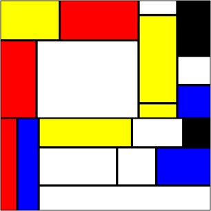

# Mondriaan Generator
Random image generator inspired by works of Piet Mondriaan. Works on Javascript + HTML5 Canvas  

## Use
`mondriaan(canvas, x, y, width, height);`  
where:
- `canvas`: canvas element
- `x`: X coordinate of start point (top left);
- `y`: Y coordinate of start point (top left);
- `width`: width of the image to be generated;
- `height`: width of the image to be generated.
